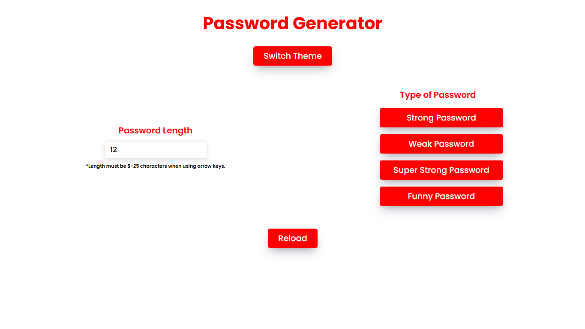
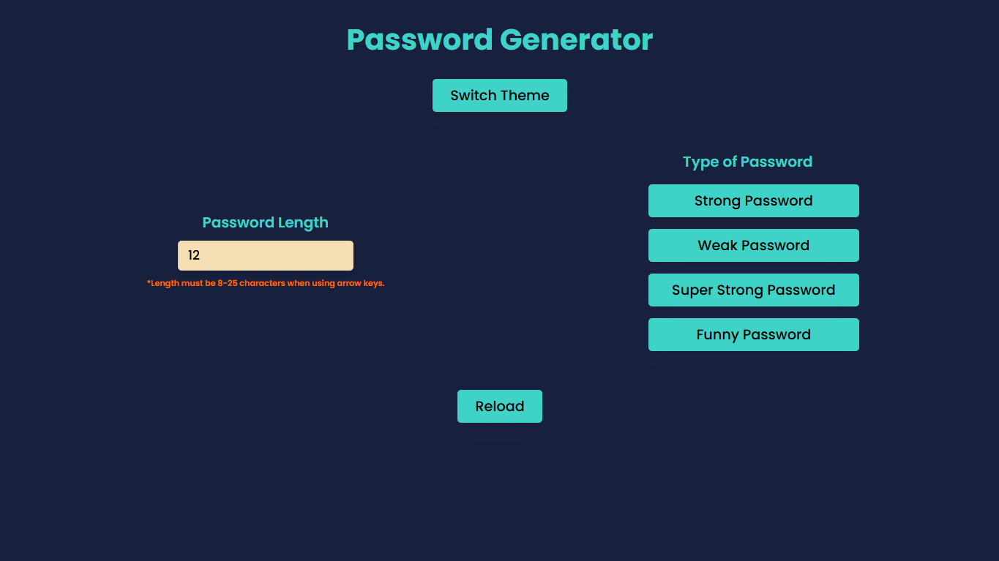

# 🔐 Password Generator

A fun, functional, and stylish password generator built with **HTML**, **CSS**, and **JavaScript**. It offers multiple password types, interactive UI, theme switching, and persistent user preferences – all wrapped in a smooth and responsive design.

[](https://password-generator-110.netlify.app/)

---

## 🌟 Features

- 🔐 Four types of passwords:
  - **Strong** – Uppercase, lowercase, numbers, and symbols
  - **Super Strong** – Letters, numbers, symbols, and extra special characters
  - **Weak** – Uppercase and lowercase only
  - **Funny** – A mix of silly words or common phrases

- 📏 Adjustable password **length selector**
- 💡 **Tooltips** for each password type to guide users
- 🌗 **Light/Dark theme** support with saved preference
- 🔁 **Generate Again** button for creating a new password of the same type
- 📋 **Copy to Clipboard** button for easy use
- 💾 **Persistent preferences** using `localStorage` (theme + password length)
- ⚙️ Smooth **animations and transitions** for a polished UI/UX

---

## 📂 Project Structure
```
📦 password-generator/ 
┣ 📜 index.html 
┣ 📜 style1.css
┣ 📜 style2.css 
┣ 📜 script.js
┗ 📜 README.md 
```

---

## 📌 How to Use

You can visit the site directly [**here**](https://password-generator-110.netlify.app/).

--- 

## 💻 Getting Started Locally

1. Clone the repo:
   ```bash
   git clone https://github.com/Preritmujoo/Password-Generator.git
   ```

2. Open `index.html` in your browser - no setup needed!

---

## 🛠️ Technologies Used

- HTML5
- CSS3 (with smooth transitions)
- JavaScript (Vanilla)
- `localStorage` API

---

## 🖼️ Screenshots

### Light Mode


### Dark Mode
